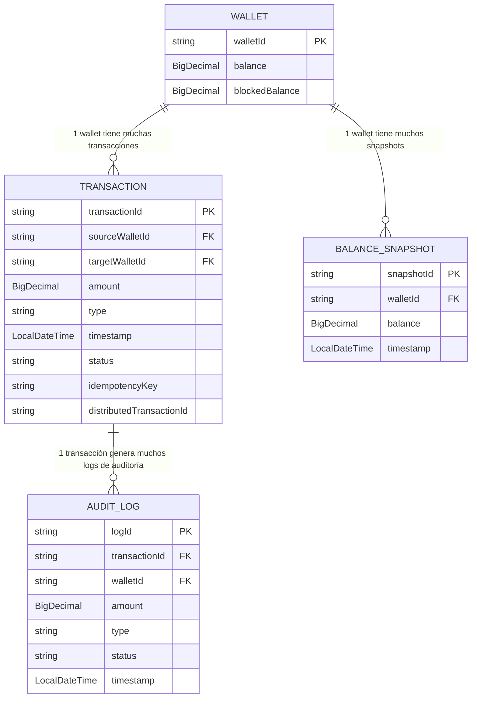

# Wallet Service

## Entity Relationship Diagram

```mermaid
erDiagram
    WALLET ||--o{ TRANSACTION : "1 wallet tiene muchas transacciones"
    WALLET ||--o{ BALANCE_SNAPSHOT : "1 wallet tiene muchos snapshots"
    TRANSACTION ||--o{ AUDIT_LOG : "1 transacción genera muchos logs de auditoría"

    WALLET {
        string walletId PK
        BigDecimal balance
        BigDecimal blockedBalance
    }

    TRANSACTION {
        string transactionId PK
        string sourceWalletId FK
        string targetWalletId FK
        BigDecimal amount
        string type
        LocalDateTime timestamp
        string status
        string idempotencyKey
        string distributedTransactionId
    }

    BALANCE_SNAPSHOT {
        string snapshotId PK
        string walletId FK
        BigDecimal balance
        LocalDateTime timestamp
    }

    AUDIT_LOG {
        string logId PK
        string transactionId FK
        string walletId FK
        BigDecimal amount
        string type
        string status
        LocalDateTime timestamp
    }
```